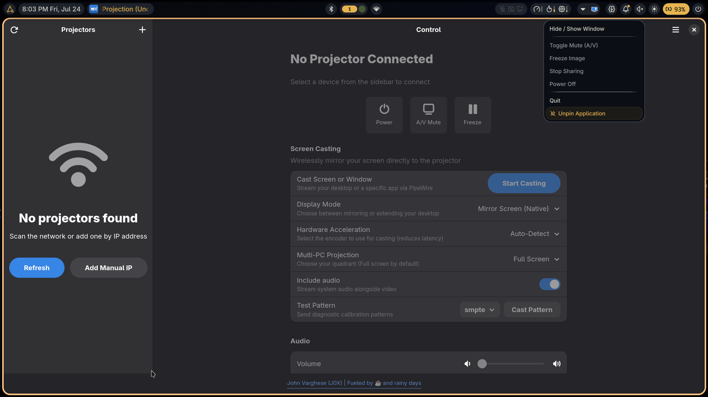

<div align="center">
  
  <h1>iProjection for Linux (Unofficial)</h1>
  <p><b>The ultimate Epson projector software for Linux. Provides native control, screen casting, and serves as an alternative Epson software/driver for Linux.</b></p>
  
  [](https://github.com/John-Varghese-EH/Linux-iProjection/actions/workflows/ci.yml)
  [](https://aur.archlinux.org/packages/linux-iprojection)
  [](https://launchpad.net/iprojection)
  [](https://www.gnu.org/licenses/agpl-3.0)
  [](https://www.python.org/downloads/)
</div>

A native Linux application for controlling and casting to Epson projectors. Provides complete network control via ESC/VP.net, PJLink, and EShare protocols, featuring a GTK4/libadwaita interface alongside a full-featured CLI for scripting.

If you are looking for **Epson iProjection for Linux**, this open-source client provides a comprehensive alternative to the official Epson projector software/driver, enabling seamless screen mirroring and remote control natively on Linux distributions.

## Core Capabilities

* **Native GTK4 Interface:** Fast, responsive UI built with GTK4 and libadwaita.
* **CLI Automation:** Command line interface for shell scripts and remote administration over SSH.
* **Network Auto-Discovery:** Automatic detection of network projectors via mDNS and LAN probing.
* **Diagnostics & Monitoring:** Live hardware monitoring for lamp hours, power state, input sources, and error logs.
* **PipeWire Screen Casting:** Low-latency desktop screen mirroring over RTP/UDP using PipeWire and XDG Desktop Portal.
* **PJLink Security:** Authentication support for password-protected projectors.



## Installation

### Arch Linux (AUR)
The application is available on the [Arch User Repository (AUR)](https://aur.archlinux.org/packages/linux-iprojection). Install using your preferred helper:
```bash
yay -S linux-iprojection
# or
paru -S linux-iprojection
```

Or build manually via `makepkg` (pacman):
```bash
git clone https://aur.archlinux.org/linux-iprojection.git
cd linux-iprojection
makepkg -si
```

### Ubuntu / Debian (PPA)
For automated updates on Debian-based systems, add the [official PPA](https://launchpad.net/iprojection):
```bash
sudo add-apt-repository ppa:cyber-trinity/linux-iprojection
sudo apt update
sudo apt install linux-iprojection
```

Alternatively, you can deploy the standalone `.deb` package directly from the [Releases](https://github.com/John-Varghese-EH/Linux-iProjection/releases) page:
```bash
sudo dpkg -i linux-iprojection_*.deb
sudo apt-get install -f
```

### Universal Linux (Flatpak)
Download the sandboxed `linux-iprojection-linux.flatpak` bundle from the [Releases](https://github.com/John-Varghese-EH/Linux-iProjection/releases) page and install it natively on any modern distribution:
```bash
flatpak install --user linux-iprojection-linux.flatpak
```

### Build from Source
To run the application via Python or deploy a development environment:
```bash
git clone https://github.com/John-Varghese-EH/Linux-iProjection.git
cd Linux-iProjection
python3 -m venv .venv
source .venv/bin/activate
pip install -e .
```

## Command Line Interface

The included `linux-iprojection` binary provides full parity with the graphical interface, making it ideal for automation.

```bash
# Discover all projectors broadcasting on the local subnet
linux-iprojection discover

# Manage hardware power state
linux-iprojection power on 192.168.1.100
linux-iprojection power off 192.168.1.100

# Switch the active video input (e.g., HDMI1, VGA, LAN)
linux-iprojection source HDMI1 192.168.1.100

# Retrieve real-time telemetry and hardware status
linux-iprojection status 192.168.1.100
```

## Contributing

Contributions to the codebase are strongly encouraged. For major architectural changes or new protocol support, please open an issue first to discuss the implementation strategy. All patches must pass the integrated test suite prior to review.

To run the automated tests and linter locally:
```bash
make test
make lint
```

## License & Attribution

Architected & developed with ❤️ by **[John Varghese (J0X)](https://github.com/John-Varghese-EH)**. 
- Connect with me on [LinkedIn](https://www.linkedin.com/in/John--Varghese).

This project is licensed under the **AGPL-3.0 License**. See the [LICENSE](LICENSE) file for the full legal text. 

*Disclaimer: This is an unofficial, community-driven application and is not affiliated with, endorsed by, or sponsored by Seiko Epson Corporation.*
